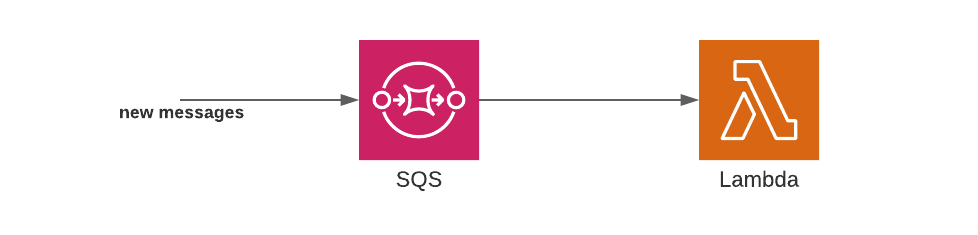
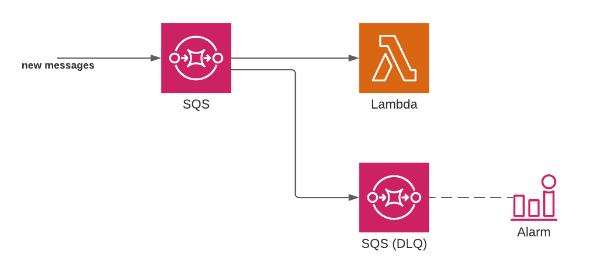
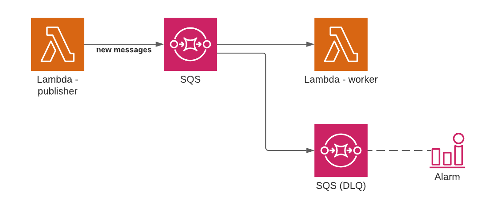

# Serverless SQS Integration

Estudo e implementação de uma fila SQS integrada a uma AWS Lambda usando o Serverless Framework.

A abordagem utiliza para setup o [Serverless Framework](https://www.serverless.com/), junto a alguns plugins como o [Serverless Lift](https://www.serverless.com/plugins/lift), o Lift auxília na definição rápida de uma boa arquitetura para se implantar em um ambiente de produção.

## Razões para essa abordagem

Ao usar o Serverless Framework podemos facilmente orquestrar o SQS e a AWS Lambda para consumir e produzir filas, o mais interessante é que ambos são dimensionados automaticamente e cobrados apenas pelo custo de uso.

Nativamente é possível escrever uma Lambda como trabalhador de fila (worker) sem precisar buscar mensagens do SQS, com isso, o trabalhador é invocado automaticamente quando uma nova mensagem (job) é enviada para o SQS.
> O pacote [aws-sdk](https://www.npmjs.com/package/aws-sdk) oferece maneiras de buscar as mensagens de forma arbitrária.

### Abordagem simplista

Podemos usar o Serverless para configurar em conjunto esses 3 agentes:
- [Lambda](https://aws.amazon.com/pt/lambda/)
- [SQS](https://aws.amazon.com/pt/sqs/)
- [Worker](https://docs.aws.amazon.com/lambda/latest/dg/with-sqs.html)

Visualmente seria representado assim:



Com serverless seria configurado assim:

```yml
# serverless.yml
# ...

functions:
  worker:
    handler: worker.handler
    events:
      # Escreve a Lambda na fila SQS
      - sqs:
        arn: !GetAtt ReportGenerationQueue.Arn

resources:
  Resources:
    # Criar a fila SQS chamada ReportGenerationQueue
    ReportGenerationQueue:
      Type: AWS::SQS::Queue
```

O maior problema está no tratamento de erros e na definição das configurações gerais:

* Por padrão o SQS repete mensagens com falha indefinidamente, por exemplo, se o código tem um bug o trabalho é repetido várias vezes por dia, provavelmente desperdiçando dinheiro e recurso;
    * Para lidar com erros seria interassante criar uma fila de mensagens mortas ([SQS DLQ](https://docs.aws.amazon.com/AWSSimpleQueueService/latest/SQSDeveloperGuide/sqs-dead-letter-queues.html)).
    * Configurar o DLQ para armazenar mensagens com máximo de 14 dias (o máximo);
    * Configurar [Alarmes](https://docs.aws.amazon.com/AmazonCloudWatch/latest/monitoring/AlarmThatSendsEmail.html) para questões de observabilidade das mensagens mortas pela equipe;
* E outras configurações como: tempo limite de visibilidade, simultaneidade máxima da Lambda, envio de mensagens em lote e etc.

### Abordagem avançada

Para atender os requitos acima de tratemento de erro e configurações gerais, poderíamos nos beneficar ainda mais do Serverless Framework.

Visualmente seria representado assim:



Com serverless seria configurado assim:

```yml
# serverless.yml
# ...

functions:
  worker:
    handler: worker.handler
    timeout: 10 # segundos
    # Escala para no máximo 10 instâncias de worker 
    reservedConcurrency: 10
    events:
      - sqs:
        arn: !GetAtt ReportGenerationQueue.Arn
        # Processa mensagens sem
        batchSize: 1

resources:
  Resources:
    # Crie uma fila SQS
    ReportGenerationQueue:
      Type: AWS::SQS::Queue
      Properties:
        QueueName: !Sub '${AWS::StackName}-myqueue'
        # 6 vezes o tempo limite da função lambda
        VisibilityTimeout: 60
        # As mensagens serão ser armazenado (e repetido) até 2 dias
        MessageRetentionPeriod: 172800
        RedrivePolicy:
          # Os trabalhos serão repetidos 5 vezes
          maxReceiveCount: 5
          # Enviar mensagens com falha para a fila de mensagens mortas
          deadLetterTargetArn: !GetAtt DeadLetterQueue.Arn

      # Mensagens com falha serão enviadas para esta fila
      DeadLetterQueue:
        Type: AWS::SQS::Queue
        Properties:
          # Armazena mensagens até 14 dias (o máximo)
          # queremos tempo para depurar/analisar
          MessageRetentionPeriod: 1209600
```

Mas ainda nem foi configurado a opção de alarmes, e isso já está ficando difícil de entender.

### Abordagem avançada: um toque especial com Lift

Para se preocupar um pouco menos com a definição extensa dessa arquitetura, podemos utilizar o [Serverless Lift](https://www.serverless.com/plugins/lift).

Esse plugin do Serverless Framework irá lidar com várias configurações seguindo as melhores práticas:

* Configuração de uma fila SQS
* Configuração de uma fila SQS DLQ
* Configuração de um work para uma Lambda
* Configuração de um alarme
* Configuração automática das [permissões do IAM](https://docs.aws.amazon.com/lambda/latest/dg/access-control-identity-based.html), isso é bom para a Lambda de envio de mensagens para a fila do SQS, que pode ser configurada no mesmo arquivo de configuração da Lambda que recebe as mensagens

Visualmente seria representado assim:



Com serverless seria configurado assim:

```yml
# serverless.yml
# ...

functions:
  publisher:
    handler: publisher.handler
    environment:
      QUEUE_URL: ${queues:report-generation.queueUrl}

queues:
  report-generation:
    alarm: dummy@my-dummy-company.com
    worker:
      handler: worker.handler
      # Escala para no máximo 10 instâncias de trabalho 
      reservedConcurrency: 10

plugins:
  - serverless-lift
```

## Implementação do estudo

As Lambdas foram escritas com Node.js.

A Lambda de publicação da mensagem no SQS utiliza o pacote [aws-sdk](https://www.npmjs.com/package/aws-sdk).

Foram utilizados alguns outros plugins, como:

* [Serverless Webpack](https://www.serverless.com/plugins/serverless-webpack): para agrupar as funções Lambda com Webpack.

## Instalação

Instale as dependências

```bash
npm install 
```

Caso deseje implanta essa arquitetura na AWS, execute o comando:

```bash
npm run deploy 
```

> Nas configurações do Serverless atente-se a configuração de profile, executando na máquina local o perfil da sua conta AWS precisa está devidamente configurado. É possivel configurar usando a [AWS CLI](https://docs.aws.amazon.com/cli/latest/userguide/cli-chap-getting-started.html).

Caso deseje desimplanta essa arquitetura na AWS, execute o comando:

```bash
npm run undeploy 
```

Caso deseje enviar uma mensagem para a fila SQS configurada, execute o comando:

```bash
npm run send-message 
```

> Caso tenha implantado na sua conta da AWS, acompanhe os logs da Lambda receiver para visualizar a mensagem recebida.

## Considerações

Esse artigo me inspirou :] recomendo a leitura:

* [Artigo medium](https://medium.com/serverless-transformation/serverless-queues-and-workers-designing-lift-d870afdba867)

> Qualquer semelhança não é mera coincidência, usei alguns pontos desse artigo para explicar a motivação do estudo nesse README, me ajudou a fixar o propósito da implementação.

> O Lift faz muito mais do que esse estudo conseguiu extrair, acompanhe o [Lift no GitHub](https://github.com/getlift/lift).

## Melhorias em andamento (WIP):

A ideia é tentar abordar outros pontos para garantir um código limpo e escalável para um time de 1 a N membros, como:

* Trabalhar localmente usando [Serverless Offline](https://www.serverless.com/plugins/serverless-offline)
    * Provavelmente usando [LocalStack](https://github.com/localstack/localstack) e [ElasticMQ](https://github.com/softwaremill/elasticmq) para emular localmente em containers os serviços da AWS como Lambda e SQS
* Implementar testes com [Mocha](https://mochajs.org/)
* Produtividade, padronização e qualidade de código com [Prettier](https://prettier.io/) e [Eslint](https://eslint.org/)
* Monitoramento com AWS [CloudWatch](https://aws.amazon.com/pt/cloudwatch/)
* Entrega contínua com [AWS CodePipeline](https://aws.amazon.com/pt/codepipeline/)

## License

[MIT licensed](LICENSE).
